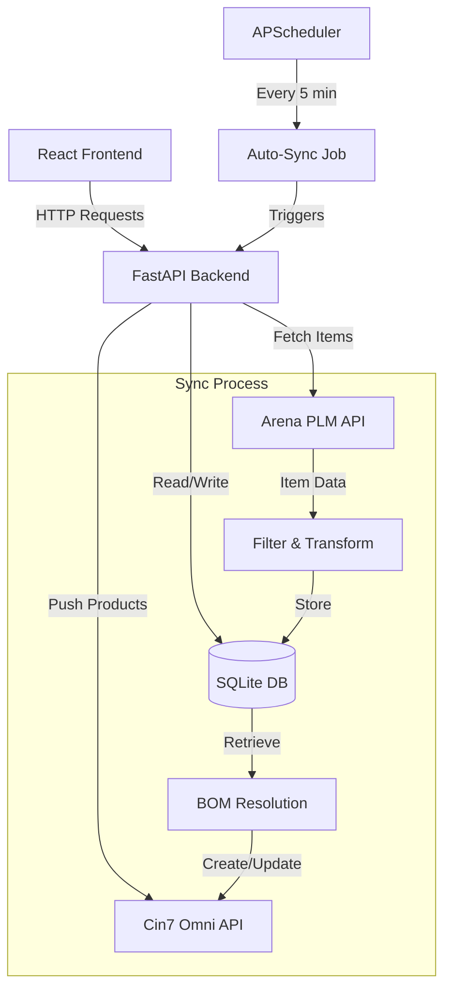

# Codebase Analysis: Cin7-Arena Connector

## 📋 Project Overview

**Project Name:** Cin7-Arena Connector  
**Purpose:** Automated data synchronization between Arena PLM (Product Lifecycle Management) and Cin7 Omni ERP systems  
**Architecture:** Full-stack web application with Python backend and React frontend  
**Deployment:** Dockerized application with separate containers for backend and frontend

---

## 🎯 Business Objective

This connector automates the transfer of **Item** and **Bill of Materials (BOM)** data from Arena PLM to Cin7 Omni, ensuring product data consistency between engineering (Arena) and operations/inventory (Cin7) systems.

### Key Business Rules

1. **Event-Driven Sync:** Triggered when Arena Change Objects reach "Completed" lifecycle status
2. **Selective Sync Filter:** Only items with "Transfer Data to ERP?" = "Yes" are synced
3. **BOM Exception Handling:** Parent items can sync even if some child components are excluded
4. **Lifecycle Filtering:** Only items in production stages (In Production, Deprecated, Obsolete, Production) are synced

---

## 🏗️ Architecture Overview

```
┌─────────────────────────────────────────────────────────┐
│                    Docker Compose                        │
├──────────────────────┬──────────────────────────────────┤
│   Frontend (React)   │      Backend (FastAPI)           │
│   Port: 80           │      Port: 8000                  │
│   - Vite + React     │      - Python 3.x                │
│   - TailwindCSS      │      - FastAPI Framework         │
│   - React Router     │      - SQLAlchemy ORM            │
│   - Axios            │      - SQLite Database           │
│                      │      - APScheduler               │
└──────────────────────┴──────────────────────────────────┘
           │                          │
           └──────────┬───────────────┘
                      │
        ┌─────────────┴─────────────┐
        │   External APIs            │
        ├────────────┬───────────────┤
        │ Arena PLM  │  Cin7 Omni    │
        └────────────┴───────────────┘
```

---

## 📁 Project Structure

```
cin7-areena-connector/
├── backend/
│   ├── services/
│   │   ├── arena_service.py      # Arena API client
│   │   ├── cin7_service.py       # Cin7 API client
│   │   └── sync_service.py       # Core sync orchestration
│   ├── main.py                   # FastAPI application & routes
│   ├── models.py                 # SQLAlchemy database models
│   ├── schemas.py                # Pydantic validation schemas
│   ├── database.py               # Database configuration
│   ├── requirements.txt          # Python dependencies
│   ├── Dockerfile                # Backend container config
│   └── connector.db              # SQLite database file
├── frontend/
│   ├── src/
│   │   ├── components/
│   │   │   ├── Layout.jsx
│   │   │   ├── ConfigurationForm.jsx
│   │   │   ├── SyncResultModal.jsx
│   │   │   ├── SyncRulesManager.jsx
│   │   │   ├── OnDemandSync.jsx
│   │   │   └── TestingTools.jsx
│   │   ├── pages/
│   │   │   ├── Dashboard.jsx
│   │   │   ├── Configuration.jsx
│   │   │   ├── Tools.jsx
│   │   │   └── Logs.jsx
│   │   ├── App.jsx
│   │   └── api.js                # API client
│   ├── package.json
│   ├── Dockerfile
│   └── nginx.conf
├── docker-compose.yml
├── docker-compose.prod.yml
└── project-description.md
```

---

## 🔧 Backend Architecture

### Technology Stack

- **Framework:** FastAPI (modern Python web framework)
- **Database:** SQLite with SQLAlchemy ORM
- **Scheduler:** APScheduler (background job scheduling)
- **HTTP Client:** Requests library
- **Validation:** Pydantic schemas

### Database Models

#### 1. Configuration (Singleton)

```python
- arena_workspace_id: str
- arena_email: str
- arena_password: str
- cin7_api_user: str
- cin7_api_key: str
- last_sync_time: datetime
- auto_sync_enabled: bool
- is_arena_connected: bool
- is_cin7_connected: bool
- item_prefix_filter: str  # Wildcard filter for item numbers
```

#### 2. ArenaItem

```python
- guid: str (Primary Key)
- item_number: str
- item_name: str
- lifecycle_phase: str
- revision: str
- category: str
- description: text
- uom: str
- costing_method: str
- auto_assemble: str
- inventory_account: str
- cogs_account: str
- sellable: str
- internal_note_erp: text
- last_glg_co: str
- transfer_to_erp: str
- manufacturer: str
- manufacturer_item_number: str
- parent_item_number: str
- last_updated: datetime
```

#### 3. SyncRule

```python
- id: int
- rule_key: str (unique)
- rule_name: str
- rule_value: str
- is_enabled: bool
```

### API Endpoints

| Method | Endpoint                | Description                               |
| ------ | ----------------------- | ----------------------------------------- |
| GET    | `/settings`             | Retrieve configuration                    |
| POST   | `/settings`             | Save configuration                        |
| POST   | `/sync/arena`           | Harvest items from Arena to local DB      |
| POST   | `/sync/cin7`            | Push items to Cin7 (supports dry_run)     |
| POST   | `/sync/auto-process`    | Manually trigger completed changes poller |
| POST   | `/sync/on-demand`       | Sync specific item by SKU                 |
| GET    | `/rules`                | List all sync rules                       |
| POST   | `/rules`                | Create new sync rule                      |
| PUT    | `/rules/{id}`           | Update sync rule                          |
| POST   | `/test/cin7/connection` | Test Cin7 API connection                  |
| GET    | `/admin/logs`           | Retrieve system logs                      |

### Core Services

#### ArenaClient (`arena_service.py`)

**Purpose:** Interface with Arena Solutions API

**Key Methods:**

- `login()` - Authenticate and obtain session ID
- `list_all_items(prefix_filter)` - Fetch items with server-side filtering
- `get_item_details(guid)` - Retrieve detailed item information
- `get_sourcing(guid)` - Get manufacturer/supplier data
- `get_bom(guid)` - Fetch Bill of Materials
- `get_changes()` - List recent change objects
- `get_change_items(change_guid)` - Get items affected by a change

**Authentication:** Session-based with Cookie header

#### Cin7Client (`cin7_service.py`)

**Purpose:** Interface with Cin7 Omni (Dear Systems) API

**Key Methods:**

- `get_product_by_sku(sku)` - Check if product exists
- `create_or_update_product(payload)` - Upsert product data
- `upload_bill_of_materials(product_id, bom_products)` - Upload BOM

**Authentication:** Header-based with account ID and API key

#### SyncService (`sync_service.py`)

**Purpose:** Orchestrate synchronization logic

**Key Functions:**

1. **`perform_sync(db)`** - Harvest from Arena
   - Fetches items from Arena API
   - Applies lifecycle and transfer filters
   - Stores in local SQLite database
   - Returns statistics on harvested/skipped items

2. **`push_to_cin7(db, dry_run)`** - Push to Cin7
   - Reads items from local database
   - Resolves BOM dependencies recursively
   - Creates/updates products in Cin7
   - Supports parallel processing (ThreadPoolExecutor)

3. **`sync_single_item(db, item_number, dry_run)`** - On-demand sync
   - Fetches specific item from Arena
   - Processes BOM if present
   - Pushes to Cin7 or returns mock payload

4. **`process_completed_changes(db, dry_run)`** - Auto-sync poller
   - Queries Arena for completed changes
   - Syncs affected items automatically
   - Scheduled to run every 5 minutes

5. **`_ensure_product_exists(db, sku, arena_client, cin7_client)`** - Recursive BOM resolver
   - Ensures all BOM components exist in Cin7
   - Creates missing components recursively
   - Prevents sync failures due to missing dependencies

### Field Mapping

#### Arena → Cin7 Product Mapping

| Arena Field                             | Cin7 Field           | Notes                   |
| --------------------------------------- | -------------------- | ----------------------- |
| item_number                             | SKU                  | Primary identifier      |
| item_name                               | Name                 |                         |
| revision                                | AdditionalAttribute1 |                         |
| category                                | Category             |                         |
| description                             | Description          |                         |
| uom                                     | UOM                  | Default: "EA"           |
| Costing Method                          | CostingMethod        | Default: "FIFO - Batch" |
| manufacturer + manufacturer_item_number | AdditionalAttribute4 | Combined string         |
| Last GLG CO                             | AdditionalAttribute2 |                         |
| Sellable                                | Sellable             | Boolean conversion      |
| Internal Note for ERP                   | InternalNote         |                         |

#### System Defaults (from SyncRule table)

- **RevenueAccount:** 4001: OEM Product
- **InventoryAccount:** 1402: Raw Materials
- **COGSAccount:** 4100: Cost of Sales
- **DefaultLocation:** Main Warehouse
- **ProductType:** Stock

### Background Scheduler

**Framework:** APScheduler  
**Job:** `run_auto_sync()`  
**Frequency:** Every 5 minutes  
**Trigger:** Immediate on startup (`next_run_time=datetime.now()`)  
**Condition:** Only runs if `auto_sync_enabled = True`

---

## 🎨 Frontend Architecture

### Technology Stack

- **Framework:** React 19.2
- **Build Tool:** Vite 7.2
- **Styling:** TailwindCSS 4.1
- **Routing:** React Router DOM 7.1
- **HTTP Client:** Axios 1.13
- **Icons:** Lucide React
- **Deployment:** Nginx (production)

### Pages

#### 1. Dashboard (`Dashboard.jsx`)

- **Purpose:** Main overview and sync controls
- **Features:**
  - Stats display (synced items, auto-sync status, last sync time)
  - Manual sync trigger buttons (dry run & live)
  - Live activity feed
  - Quick tips panel
  - Sync result modal

#### 2. Configuration (`Configuration.jsx`)

- **Purpose:** Manage API credentials and settings
- **Features:**
  - Arena credentials (workspace ID, email, password)
  - Cin7 credentials (API user, API key)
  - Auto-sync toggle
  - Item prefix filter configuration
  - Sync rules management

#### 3. Tools (`Tools.jsx`)

- **Purpose:** Testing and debugging utilities
- **Features:**
  - On-demand item sync
  - Raw Arena data inspection
  - Connection testing

#### 4. Logs (`Logs.jsx`)

- **Purpose:** System log viewer
- **Features:**
  - Real-time log streaming
  - Configurable line count
  - Auto-refresh capability

### Components

#### ConfigurationForm

- Form for API credentials
- Real-time validation
- Connection status indicators

#### SyncResultModal

- Displays sync operation results
- Shows success/failure statistics
- Detailed error reporting
- Payload preview for dry runs

#### SyncRulesManager

- CRUD interface for sync rules
- Toggle enable/disable rules
- Inline editing

#### OnDemandSync

- Single-item sync interface
- SKU input with validation
- Dry run support

#### TestingTools

- Arena API testing
- Cin7 connection verification
- Raw data inspection

---

## 🔄 Synchronization Workflow

### 1. Manual Sync (Full Process)

```
User clicks "Trigger Sync Now"
        ↓
POST /sync/cin7?dry_run=false
        ↓
perform_full_sync(db, dry_run=False)
        ↓
    ┌───────────────────────────────┐
    │  Step 1: Harvest from Arena   │
    │  - Login to Arena             │
    │  - Fetch items (filtered)     │
    │  - Apply lifecycle filter     │
    │  - Apply "Transfer to ERP?"   │
    │  - Store in SQLite            │
    └───────────┬───────────────────┘
                ↓
    ┌───────────────────────────────┐
    │  Step 2: Push to Cin7         │
    │  - Read from SQLite           │
    │  - Fetch BOMs from Arena      │
    │  - Resolve dependencies       │
    │  - Create/update in Cin7      │
    │  - Upload BOMs                │
    └───────────┬───────────────────┘
                ↓
    Return combined results to UI
```

### 2. Auto-Sync (Event-Driven)

```
APScheduler triggers every 5 minutes
        ↓
run_auto_sync()
        ↓
process_completed_changes(db)
        ↓
    ┌───────────────────────────────┐
    │  Query Arena for Changes      │
    │  - Filter status = "Completed"│
    │  - Get affected items         │
    └───────────┬───────────────────┘
                ↓
    For each affected item:
        ↓
    sync_single_item(db, sku, dry_run=False)
        ↓
    Log results
```

### 3. BOM Resolution (Recursive)

```
Parent Item needs sync
        ↓
Fetch BOM from Arena
        ↓
For each component:
    ↓
    Check if exists in Cin7
    ↓
    If NOT exists:
        ↓
        Fetch component from Arena
        ↓
        Check component's BOM (recursive)
        ↓
        Create component in Cin7
        ↓
        Upload component's BOM
        ↓
    Return component ID
        ↓
Create parent with resolved BOM IDs
```

---

## 🔐 Security Considerations

### Current Implementation

1. **Credentials Storage:** Encrypted using Fernet encryption
2. **CORS:** Wildcard (`*`) - allows all origins
3. **Authentication:** JWT-based frontend authentication
4. **API Keys:** Encrypted in database, transmitted in headers

### Recommendations

> [!WARNING]
> **Production Security Gaps:**
>
> - CORS should be restricted to specific origins
> - Use environment variables for JWT secret key
> - Implement API rate limiting
> - Add request/response logging for audit trails

---

## 📊 Data Flow Diagram



---

## 🧪 Testing & Debugging Features

### Built-in Tools

1. **Dry Run Mode:** Test sync without modifying Cin7
2. **On-Demand Sync:** Sync specific items by SKU
3. **Connection Testing:** Verify API credentials
4. **System Logs:** File-based logging (`app.log`)
5. **Sync Statistics:** Track harvested/skipped items

### Debug Scripts

- `check_db_value.py` - Inspect database values
- `debug_arena_wildcard.py` - Test Arena API filtering
- `debug_db.py` - Database debugging
- `verify_persistence.py` - Verify data persistence
- `test_automation.py` - Test auto-sync functionality

---

## 🚀 Deployment

### Docker Compose Configuration

**Development:** `docker-compose.yml`

- Backend: Port 8000
- Frontend: Port 80
- Volume mounts for hot-reload

**Production:** `docker-compose.prod.yml`

- Optimized builds
- No volume mounts
- Production-ready configurations

### Environment Variables

Currently using hardcoded values. Recommended to use:

- `ARENA_WORKSPACE_ID`
- `ARENA_EMAIL`
- `ARENA_PASSWORD`
- `CIN7_API_USER`
- `CIN7_API_KEY`
- `JWT_SECRET_KEY`

---

## 📈 Performance Characteristics

### Optimization Features

1. **Parallel Processing:** ThreadPoolExecutor with 10 workers
2. **Server-Side Filtering:** Arena API wildcard search
3. **Pagination:** 400 items per request
4. **Connection Pooling:** Requests session reuse
5. **Caching:** Browser cache disabled for settings

### Potential Bottlenecks

- Recursive BOM resolution (synchronous)
- SQLite write locks (single-threaded)
- Arena API rate limits (not implemented)
- Large BOM trees (deep recursion)

---

## 🐛 Known Issues & Limitations

### Current Limitations

1. **No High Water Mark:** Auto-sync may re-process old changes
2. **No Retry Logic:** Failed syncs are logged but not retried
3. **Limited Error Recovery:** Partial failures may leave inconsistent state
4. **No Audit Trail:** No historical record of sync operations
5. **Single Configuration:** Only one set of credentials supported

### Missing Features

- [ ] Webhook support for real-time Arena events
- [ ] Batch operation rollback
- [ ] Sync conflict resolution
- [ ] Multi-tenant support
- [ ] Comprehensive test suite
- [ ] API documentation (Swagger/OpenAPI)

---

## 🔍 Code Quality Observations

### Strengths

✅ Clean separation of concerns (services, models, schemas)  
✅ Comprehensive error handling and logging  
✅ Dry run support for safe testing  
✅ Recursive BOM resolution  
✅ Configurable sync rules  
✅ Modern tech stack (FastAPI, React)  
✅ Dockerized deployment  
✅ Encrypted credential storage  
✅ JWT-based authentication

### Areas for Improvement

⚠️ **Error Handling:** Some exception blocks are too broad  
⚠️ **Type Hints:** Inconsistent use in Python code  
⚠️ **Testing:** No unit or integration tests  
⚠️ **Documentation:** Limited inline comments  
⚠️ **Validation:** Minimal input validation on frontend  
⚠️ **State Management:** React state could use Context API or Redux

---

## 📝 Maintenance Notes

### Regular Maintenance Tasks

1. **Database Backups:** `connector.db` should be backed up regularly
2. **Log Rotation:** `app.log` will grow indefinitely
3. **Dependency Updates:** Check for security updates monthly
4. **API Changes:** Monitor Arena and Cin7 API changelogs

### Monitoring Recommendations

- Track sync success/failure rates
- Monitor API response times
- Alert on repeated failures
- Track database size growth
- Monitor scheduler job execution

---

## 🎓 Learning Resources

### External APIs

- [Arena Solutions API Documentation](https://api.arenasolutions.com/v1)
- [Cin7 Omni (Dear Systems) API](https://inventory.dearsystems.com/ExternalApi/v2)

### Technologies Used

- [FastAPI Documentation](https://fastapi.tiangolo.com/)
- [React Documentation](https://react.dev/)
- [SQLAlchemy ORM](https://www.sqlalchemy.org/)
- [TailwindCSS](https://tailwindcss.com/)

---

## 📞 Support & Contact

**Project Type:** Custom Integration  
**Client:** Jobin and Jismi  
**Developer:** cr4ckcoder

---

## 🏁 Conclusion

This is a **well-structured, production-ready integration** that successfully bridges Arena PLM and Cin7 Omni systems. The codebase demonstrates solid engineering practices with room for enhancement in testing, security, and error recovery.

**Recommended Next Steps:**

1. Implement comprehensive testing suite
2. Restrict CORS to specific origins
3. Implement high water mark for change tracking
4. Add retry logic with exponential backoff
5. Create API documentation with Swagger
6. Add monitoring and alerting capabilities
